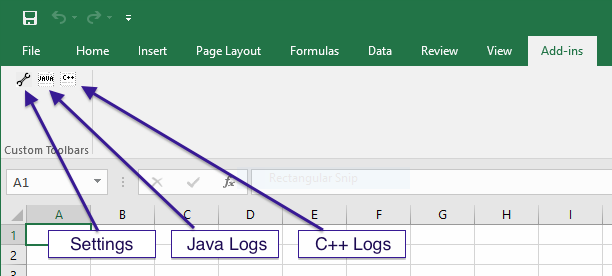

Logging
=======

## Background
A key part of troubleshooting software development is logging.  XL4J has two independent logging systems:
 1. A bespoke C++ logging system for the native portion of the Excel Add-in.
 2. A standard SLF4J/Logback logging system for the Java-based portion of the Excel Add-in.

The reason for having two separate systems is that
 1. Java hasn't necessarily been started yet by the native parts of the Add-in when logging is required.
 2. Calling from C++ into Java for every logging statement would result is very poor performance.
 3. The alternative of having Java use the C++ logging framework might be possible, but would potentially require constant calls across
    the JNI/JVM boundary, which again, can lead to poor performance.
    
In practice, C++ logging is primarily for the development of new native (C++) features so most Add-in developers are likely to find Java 
logs more useful.

## Configuration
Configuration of the logging system is covered in the [Settings](https://github.com/McLeodMoores/xl4j/blob/master/docs/settings.md) 
guide but as an overview, you can configure each logging system to produce output from log statements at a number of different logging 
levels.  These are summarised below:

| Log Level | Purpose                                                                                                    |
|-----------|------------------------------------------------------------------------------------------------------------|
| `TRACE`   | Very fine-grained flow of execution through the code, this provides typically almost excessive detail      |
| `DEBUG`   | Information that's likely to be useful only when examining the code, but at a slightly more abstract level |
| `INFO`    | General informational messages about the state of execution                                                |
| `WARN`    | Messages indicating possible errors during execution                                                       |
| `ERROR`   | Indication of error conditions which may or may not be fatal                                              |
|
| `FATAL`   | Indication of error conditions which are definitely fatal to execution                                     |

### Log target for C++
Logs from the native part of the add-in [can be configured](https://github.com/McLeodMoores/xl4j/blob/master/docs/settings.md)
to be sent to either the Windows debug system using the `OutputDebugString` Win32 API call, or sent to a file.  Output to the 
Windows debug sub-system (and to a lesser extent, a file) can be a significant performance bottleneck at log levels below `WARN`, 
so be sure to set the debug level to `WARN` or `ERROR` for day-to-day operation.

## Viewing logs
If C++/native logs are sent to the debug system, the Sysinternals utility 
[DebugView.exe](https://technet.microsoft.com/en-us/sysinternals/debugview.aspx) can be used to view the debugging output.  If a 
file is used, the C++ logs can be opened in the default registered file handling application for files with a `.log` extension by
clicking on the C++ logs icon on the toolbar:

Java logs are always stored in a file, which can be accessed using the Java log button on the toolbar.

## Log rotation
C++ logs will currently grow unbounded, so it is important not to leave the logging system in a state where it will create excessive
amounts of output.  If necessary, you can delete the log manually with no ill effects.  Java logs are automatically compressed and 
rotated once they reach 50MB in size with an archive of 9 numbered files.

## Logback configuration
Logback is configured via configuration files included in the `xll-core` project of XL4J.  They are in the directory 
`src/main/resources/com/mcleodmoores/xl4j` and consists of a set of XML configuration files called *<log-level>*`-logback.xml`, where 
*<log-level>* is the log level in lower-case.  It should be possible to add your own jar to the classpath with the same directory 
structure to override these files if editing and rebuilding the `xll-core` project is not convenient.

## Log file location on disk
Logs are actually stored in `%TEMP%\xl4j-cpp.log` and `%TEMP%\xl4j-java.log`, where `%TEMP%` is usually located somewhere like 
`C:\Users\MyName\AppData\Roaming\Temp\`.  Note that the `AppData` folder is hidden by default, so the easiest way of accessing it 
is usually to click on the path breadcrumb trail and entering/editing the path on the keyboard.  Below is an image showing you where 
to click in explorer to edit the full path (albeit the picture shows a slightly different target location).
    

