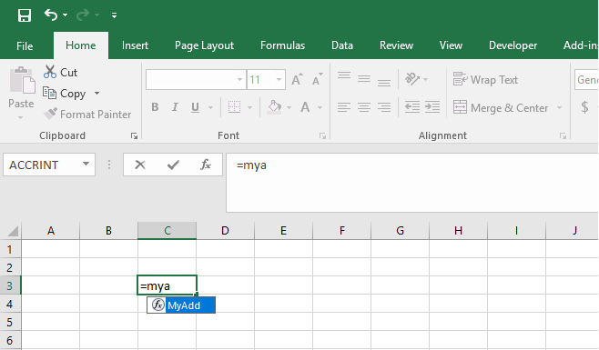
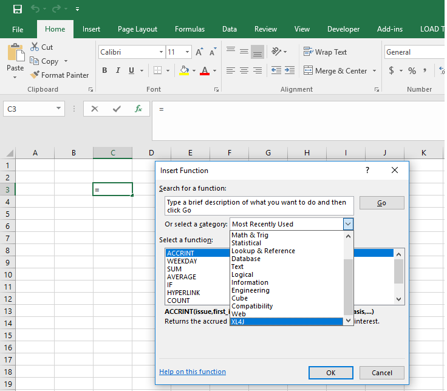
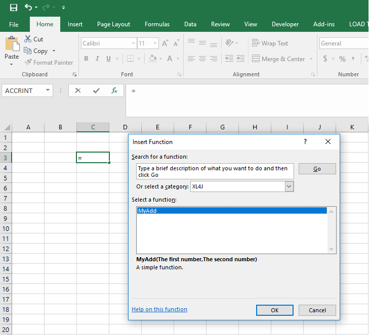
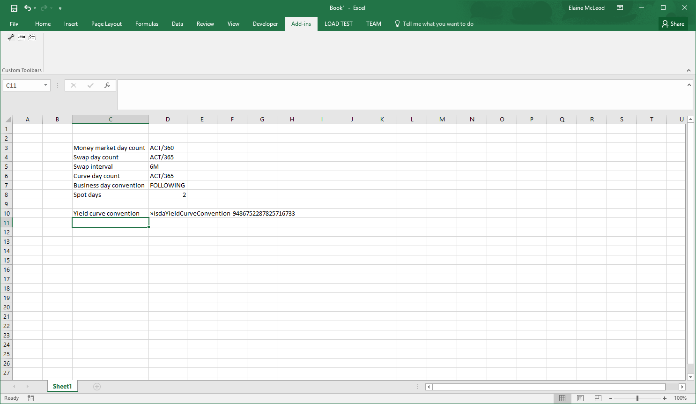
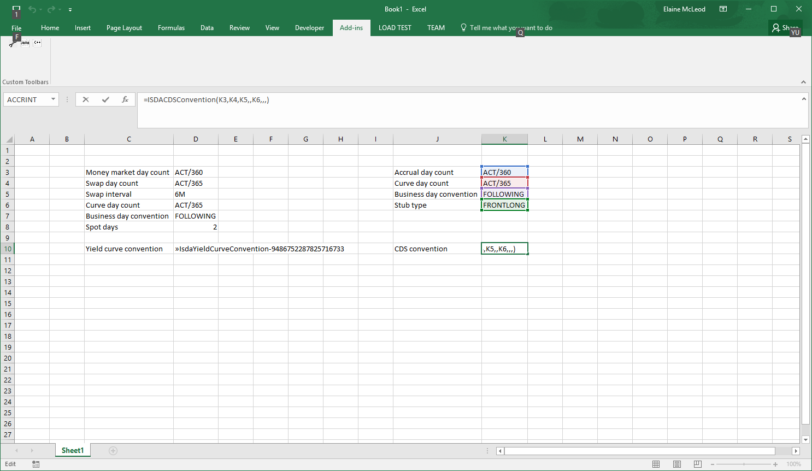

XL4J Tutorial
=============

# Getting started
## Pre-requisites
You can build XL4J Add-ins on any operating system that supports Java: you *do not need Windows or Visual Studio* unless you
want to modify the native parts of the Add-in, which is unlikely for most users.  Being able to build from Linux or MacOS
can prove very useful later on for e.g. continuous integration, but given that you're likely to want to test and use your 
Add-in in Excel, it is probably advisable to start development there.  Windows 10 is recommended, but any version of 
Windows later than Vista (7, 8, 8.1, 10, 10 Anniversary Update) should be fine.

You will need to install a current JDK and a version of Maven after 3.1.  You should also have a git client installed.  I
would suggest using the [Chocolatey](https://www.chocolatey.org) package manager, which can install these packages for you 
using:
```
choco install jdk8 maven git
```
but it's fine to just download and install them yourself too.  You'll probably want your favorite IDE too.  If you want to 
be able to actually test your Add-ins, you will probably want to install Excel too!  Any version after (not including) 
Excel 2007 is fine.

Note that you MUST have a 32-bit Java runtime (JRE) installed for XL4J to work.  I have found Chocolatey can be a bit hit and miss
at installing this correctly, so I'd recommend downloading the i586 version of the JRE yourself and installing manually.

## Cloning the template project
We've provided a template project that you can use to get started.  It's very basic, and just consists of a Maven POM which pulls 
in the required libraries and a Maven assembly plug-in manifest which describes how to package the resulting Add-in into both a 
directory (so you can use it directly) and a zip file for distribution.

Start by cloning the project:
```
git clone https://github.com/McLeodMoores:xl4j-template.git
```
Inside you'll find a standard Maven project layout.  Now is a good time to import this project into your IDE of choice, or
fire up a text editor.  

## Adding a new custom Excel function
Try adding this class:
``` java
package com.mcleodmoores.xl4j.template;

import com.mcleodmoores.xl4j.XLFunction;

public final class MyFunctions {

  @XLFunction(name = "MyAdd", description = "A simple function", category = "XL4J")
  public static double myadd(
      @XLParameter(name = "One", description = "The first number") final double one,
      @XLParameter(name = "Two", description = "The second number") final double two) {
    return one + two;
  }
  
}
```
## Build the Add-in
Then build using:
```
mvn install
```
This will pull in the required libraries and produce the build artifact.  Have a look in `xl4j-template\target` and you should see two 
files:
 - A folder called `xl4j-template-0.0.1-SNAPSHOT-distribution`
 - A zip file containing that folder called `xl4j-template-0.0.1-SNAPSHOT-distribution.zip`
 
## Manually add the Add-in to Excel
 1. Start Excel.
 2. On the Backstage (the screen revealed by clicking on the `File` ribbon header or Office button), choose Options.
 3. Go to `Add-ins`
 4. Next to the dropdown list towards the botton called `Manage:`, select `Excel Add-ins` and click `Go`.
 5. Click `Browse`, navigate to the `xl4j-template-0.0.1-SNAPSHOT-distribution` folder, open the folder containing the appropriate distribution and select the add-in.
 6. Click `OK`. You should see a popup and a splashscreen once you've clicked `OK`.
 7. Start typing in your function name. Excel will autocomplete the name:
    
 
    Or you can use the function wizard:
    
 
    
 
 **TODO add an image of the argument wizard when it's fixed**

# Using Java projects from Excel
## A simple wrapper
 
In this example, we are going to write a layer that allows the **TODO link** starling implementation of the ISDA CDS model to be used from Excel. To get pricing and risk metrics, we need 
  - A yield curve
  - A CDS curve
  - A CDS trade definition
  
Just for reference, here is some example Java code that constructs a yield curve using the starling library:
  
  ``` java
  /** The trade date */
  private static final LocalDate TRADE_DATE = LocalDate.of(2016, 10, 3);
  /** The quotes */
  private static final double[] QUOTES = new double[] {0.001, 0.0011, 0.0012, 0.002, 0.0035,
      0.006, 0.01, 0.015, 0.025, 0.04};
  /** The money market day count */
  private static final String MONEY_MARKET_DAY_COUNT = "ACT/360";
  /** The swap day count */
  private static final String SWAP_DAY_COUNT = "ACT/365";
  /** The swap interval */
  private static final String SWAP_INTERVAL = "6M";
  /** The curve day count */
  private static final String CURVE_DAY_COUNT = "ACT/365";
  /** The business day convention */
  private static final String BDC = "Modified Following";
  /** The spot date */
  private static final LocalDate SPOT_DATE = LocalDate.of(2016, 10, 5);
  /** The number of spot days */
  private static final int SPOT_DAYS = 2;
  /** The holidays */
  private static final LocalDate[] HOLIDAYS = new LocalDate[] {LocalDate.of(2016, 8, 1)};
  /** The calendar */
  private static final Calendar CALENDAR =
      new CalendarAdapter(new SimpleWorkingDayCalendar("Calendar", Arrays.asList(LocalDate.of(2016, 8, 1)), DayOfWeek.SATURDAY, DayOfWeek.SUNDAY));
  /** The yield curve */
  private static final ISDACompliantYieldCurve YIELD_CURVE;

  static {
    final ISDAInstrumentTypes[] instrumentTypes = new ISDAInstrumentTypes[] {
        ISDAInstrumentTypes.MoneyMarket, ISDAInstrumentTypes.MoneyMarket, ISDAInstrumentTypes.MoneyMarket, ISDAInstrumentTypes.Swap,
        ISDAInstrumentTypes.Swap, ISDAInstrumentTypes.Swap, ISDAInstrumentTypes.Swap, ISDAInstrumentTypes.Swap, ISDAInstrumentTypes.Swap,
        ISDAInstrumentTypes.Swap};
    final Period[] tenors = new Period[] {Period.ofMonths(3), Period.ofMonths(6), Period.ofMonths(9),
        Period.ofYears(1), Period.ofYears(2), Period.ofYears(3), Period.ofYears(4), Period.ofYears(5), Period.ofYears(7),
        Period.ofYears(10)};
    final ISDACompliantYieldCurveBuild builder = new ISDACompliantYieldCurveBuild(TRADE_DATE, SPOT_DATE, instrumentTypes, tenors,
        DayCountFactory.INSTANCE.instance(MONEY_MARKET_DAY_COUNT), DayCountFactory.INSTANCE.instance(SWAP_DAY_COUNT), Period.ofMonths(6),
        DayCountFactory.INSTANCE.instance(CURVE_DAY_COUNT), BusinessDayConventionFactory.INSTANCE.instance(BDC),
        CALENDAR);
    CURVE = builder.build(QUOTES);
    }
  ```
The curve is built from convention information (day-counts, payment intervals, etc.), a list of instruments used in the curve, the tenors of these instruments, a working day calendar, and market data. As conventions are defined on a per-currency basis, we are going to bundle all of the convention information into a class and then add functions that allow these objects to be constructed in Excel. This means that conventions can be stored in Excel tables.
 
** TODO links to all of the classes referenced **
### The conventions
We've added two POJOs, ```IdsaYieldCurveConvention``` and ```IsdaCdsConvention``` that contain all of the convention information for yield curves and CDS, and a utility class, ```ConventionFunctions```, that contains static Excel functions that build these objects.
 
The yield curve convention builder is simple: all fields are required and can be represented as ```String``` or ```int```. 
This method takes Excel types (```XLString, XLNumber```) as arguments, which means that there is no type conversion done on the objects coming from the add-in.

 ``` java
   @XLFunction(name = "ISDAYieldCurveConvention", category = "ISDA CDS model", description = "Create a yield curve convention")
  public static IsdaYieldCurveConvention buildYieldCurveConvention(
      @XLParameter(description = "Money Market Day Count", name = "Money Market Day Count") final XLString xlMoneyMarketDayCountName,
      @XLParameter(description = "Swap Day Count", name = "Swap Day Count") final XLString xlSwapDayCountName,
      @XLParameter(description = "Swap Interval", name = "Swap Interval") final XLString xlSwapIntervalName,
      @XLParameter(description = "Curve Day Count", name = "Curve Day Count") final XLString xlCurveDayCountName,
      @XLParameter(description = "Business Day Convention", name = "Business Day Convention") final XLString xlBusinessDayConventionName,
      @XLParameter(description = "Spot Days", name = "spotDays") final XLNumber xlSpotDays) {
    final DayCount moneyMarketDayCount = DayCountFactory.INSTANCE.instance(xlMoneyMarketDayCountName.getValue());
    final DayCount swapDayCount = DayCountFactory.INSTANCE.instance(xlSwapDayCountName.getValue());
    final DayCount curveDayCount = DayCountFactory.INSTANCE.instance(xlCurveDayCountName.getValue());
    final BusinessDayConvention businessDayConvention = BusinessDayConventionFactory.INSTANCE.instance(xlBusinessDayConventionName.getValue());
    final Period swapInterval = parsePeriod(xlSwapIntervalName.getValue());
    return new IsdaYieldCurveConvention(moneyMarketDayCount, swapDayCount, swapInterval, curveDayCount, businessDayConvention, xlSpotDays.getAsInt());
  }
```
The ```@XLFunction``` annotation means that this method is available from Excel. The fields are self-explanatory: the name of the function, a more detailed description and the category that the function will appear in. None of these properties are mandatory - the default value for the name is the method name, the class name for the category and an empty description if they are not filled in. There are other properties that will be discussed in more detail later. The ```@XLParameter``` properties have the same meaning as those in the function annotation.
 
After this function is built, it can be called from Excel
 

 


 
The CDS convention builder is very similar to the yield curve convention builder, but some fields are optional:
 ``` java
   @XLFunction(name = "ISDACDSConvention", category = "ISDA CDS model", description = "Create a CDS convention")
  public static IsdaCdsConvention buildCdsConvention(
      @XLParameter(description = "Accrual Day Count", name = "Accrual Day Count") final XLString xlAccrualDayCountName,
      @XLParameter(description = "Curve Day Count", name = "Curve Day Count") final XLString xlCurveDayCountName,
      @XLParameter(description = "Business Day Convention", name = "Business Day Convention") final XLString xlBusinessDayConventionName,
      @XLParameter(description = "Coupon Interval", name = "Coupon Interval", optional = true) final XLString xlCouponInterval,
      @XLParameter(description = "Stub Type", name = "Stub Type", optional = true) final XLString xlStubType,
      @XLParameter(description = "Cash Settlement Days", name = "Cash Settlement Days", optional = true) final XLNumber xlCashSettlementDays,
      @XLParameter(description = "Step In Days", name = "Step In Days", optional = true) final XLNumber xlStepInDays,
      @XLParameter(description = "Pay Accrual On Default", name = "Pay Accrual On Default", optional = true) final XLBoolean xlPayAccrualOnDefault) {
    final String stubType = xlStubType == null ? null : xlStubType.getValue();
    final Integer cashSettlementDays = xlCashSettlementDays == null ? null : xlCashSettlementDays.getAsInt();
    final Integer stepInDays = xlStepInDays == null ? null : xlStepInDays.getAsInt();
    final Boolean payAccrualOnDefault = xlPayAccrualOnDefault == null ? null : xlPayAccrualOnDefault.getValue();
    return new IsdaCdsConvention(xlAccrualDayCountName.getValue(), xlCurveDayCountName.getValue(), xlBusinessDayConventionName.getValue(),
        xlCouponInterval.getValue(), stubType, cashSettlementDays, stepInDays, payAccrualOnDefault);
  }
 ```
As optional values are passed in as nulls, it's necessary to test for them and handle appropriately. Optional values are dealt with in the usual Excel way by leaving the argument blank in the formula:



 The next stage is to actually construct the yield and CDS curves. Again, the wrapper class has been written with various static methods that call into the starling code. For these methods, the arguments are standard Java objects (e.g. double[]) rather than ```XLValue```, which means that type conversion is performed automatically. This means that we don't have to think about how to deal with arrays (what if the data were passed in as a row? a column?), as well as cutting down on the boilerplate of unwrapping and casting these objects to the types that are needed.
 
 ``` java
   @XLFunction(name = "ISDAYieldCurve.BuildCurveFromConvention", category = "ISDA CDS model",
      description = "Build a yield curve using the ISDA methodology")
  public static ISDACompliantYieldCurve buildYieldCurve(
      @XLParameter(description = "Trade Date", name = "Trade Date") final LocalDate tradeDate,
      @XLParameter(description = "Instrument Types", name = "Instrument Types") final String[] instrumentTypeNames,
      @XLParameter(description = "Tenors", name = "Tenors") final String[] tenors,
      @XLParameter(description = "Quotes", name = "Quotes") final double[] quotes,
      @XLParameter(description = "Convention", name = "Convention") final IsdaYieldCurveConvention convention,
      @XLParameter(description = "Spot Date", name = "Spot Date", optional = true) final LocalDate spotDate,
      @XLParameter(description = "Holidays", name = "Holidays", optional = true) final LocalDate[] holidayDates) {
 ```
 This class contains two methods that construct yield curves; one that takes a convention object and another that constructs the convention itself. Note that although the methods are overloaded in the Java code, as you'd expect, the names of the functions are different. All function names in Excel must be unique; if a function has already been registered with the name, this is logged and the function ignored.
 
 
 
 ## Starting from scratch
 
 We're going to build a sheet that takes historical time series data from **Quandl insert link**, performs some basic statistical analysis and compares a long-only portfolio to the efficient frontier. 
 
A prerequisite for any sort of time series analysis is to make sure that the data are clean (e.g. no spikes)  and consistent across dates (i.e. all have the same dates with no missing values). To do this, we should at a minumum:
 
  - Allow the time series to be sampled at a particular frequency e.g. daily or monthly
  - Have the ability to pad the series when there is no data for a particular date

It is certainly possible to do these operations using only Excel and / or VBA. However, it's easier write functions in Java to do this, with the added bonus that the resulting spreadsheet is smaller (10 years of daily data is ~2500 data points - that's a lot of rows or columns to manage), which means, amongst other things, that any errors or problems like ```#VALUE!``` can be more easily spotted.

We start with a toy  implementation that extends a ```SortedMap```. There's a factory method that takes either a ```2 x n``` or ```n x 2``` range and returns the ```TimeSeries``` as an **object**:

```java
  @XLFunction(name = "TimeSeries",
      description = "Create a time series",
      category = "Time series",
      typeConversionMode = TypeConversionMode.OBJECT_RESULT)  // NOTE THE CONVERSION MODE
  public static TimeSeries of(@XLParameter(name = "datesAndValues", description = "The dates and values") final XLValue... datesAndValues) {
    ArgumentChecker.notNull(datesAndValues, "datesAndValues");
    if (datesAndValues.length == 1 && datesAndValues[0] instanceof XLArray) {
      return ofRange((XLArray) datesAndValues[0]);
    } else if (datesAndValues.length == 2 && datesAndValues[0] instanceof XLArray && datesAndValues[1] instanceof XLArray) {
      return of((XLArray) datesAndValues[0], (XLArray) datesAndValues[1]);
    }
    throw new XL4JRuntimeException("Cannot create time series from input");
  }
```

The only difference between this function and the ones in the previous section is that the conversion mode for the results is set to ```OBJECT_RESULT```. ```OBJECT_RESULT``` functions do not perform any conversions, so the sheet will show an object reference. 


The default mode is ```SIMPLEST_RESULT```, which performs conversions to Excel types (e.g. ```Double``` to ```XLNumber```) where a converter is available, or returns an ```XLObject``` for more complex types without converters, like ```ISDACompliantYieldCurve```. 

For this example, we will use functions with ```OBJECT_RESULT``` , as this will help with our stated aim of writing a compact spreadsheet. 

We've also added a function that expands a time series to an Excel array:

```java
  @XLFunction(name = "ExpandTimeSeries",
      description = "Expand a time series into an array",
      category = "Time series",
      typeConversionMode = TypeConversionMode.SIMPLEST_RESULT)
  public static TimeSeries expand(@XLParameter(name = "timeSeries", description = "time series object") final TimeSeries timeSeries) {
    return timeSeries;
  }
```

At first, this function does not look like it does anything to the time series. However, note that the conversion mode is ```SIMPLEST_RESULT```. If we add a class that converts , then the time series will be converted to an array that can be used like any array formula in Excel:


Next, we need functions that generate schedules, a sampling function that gets the dates and values from a time series for a particular schedule, functions that deal with missing data, return calculators and arithmetic operations. All of these classes are in the  package.

One of these functions is a percentage return calculator:

```java
@XLNamespace("TimeSeries.")
@XLFunctions(
    prefix = "PercentageReturn",
    typeConversionMode = TypeConversionMode.OBJECT_RESULT,
    description = "Calculates the percentage return of a time series",
    category = "Time Series")
public class PercentageReturnCalculator implements TimeSeriesFunction<TimeSeries> {

  @Override
  public TimeSeries apply(final TimeSeries ts) {
    ArgumentChecker.notNull(ts, "ts");
    final int n = ts.size();
    ArgumentChecker.isTrue(n > 1, "Need more than one data point to calculate the returns");
    final TimeSeries result = TimeSeries.newTimeSeries();
    final Double[] previous = new Double[] { ts.get(ts.firstKey()) };
    ts.entrySet().stream().skip(1L).forEach(e -> {
      result.put(e.getKey(), e.getValue() / previous[0] - 1);
      previous[0] = e.getValue();
    });
    return result;
  }

}
``` 
There are two annotations that weren't used in the other examples: ```XLNamespace``` and ```XLFunctions```.

#### ```XLNamespace```

As its name implies, this annotation allows functions to be categorised into namespaces by prepending the value of the annotation to all functions in a class. This can be very useful if you have a large number of functions, as they will be sorted alphabetically in a drop-down list.


#### ```XLFunctions```

The ```XLFunctions``` annotation is used when you want to register all **public** constructors and methods, including static methods, in a class (with the exception of the methods from ```Object```: ```hashCode```, ```equals```, ```toString```, ```finalize```, ```getClass```, ```wait```, ```notify```, ```notifyAll``` and ```clone``` - if you need one of these methods then you'll need to add an explicit ```XLFunction``` annotation to it). 

The fields in this annotation are fairly straightforward:
  - ```prefix``` is an optional field that effectively renames a class. In the ```PercentageReturnCalculator``` class shown above, the prefix field is set to ```PercentageReturn```. This means that the function name for the constructor is ```TimeSeries.PercentageReturn```, while the ```apply``` method's function name is ```TimeSeries.PercentageReturn.apply```. If this field is not set, the class name is used instead (e.g. giving ```TimeSeries.PercentageReturnCalculator``` and ```TimeSeries.PercentageReturnCalculator.apply```).
  - ```typeConversionMode``` sets the return type mode of the methods in the class. By default, it is set to return the simplest result, which means that if there are any converters available for the return type they will be used.
  - ```description``` provides the description of the constructors and methods 
  - ```category``` puts all constructor and method functions into a particular category.

The registered functions for the percentage return calculator are:


Note that when the functions are registered, the visibility of the constructors or methods is not changed, so only ```public``` ones will be registered. 

### The sample sheet

Using the functions that we've created, we can now put together our sheet. The ```Market Data``` sheet makes a call to Quandl for data and splits the ```TabularResult``` by field name:


The ```Statistics``` sheet uses the calculators that we've written to prepare the time series data:


and calculate some statistics:


Finally, the ```Efficient Frontier``` page uses some Java functions, such as the covariance matrix calculator:


and inbuilt Excel functions:


and Solver


to calculate minimum risk portfolio weights for various target returns. Much more straightforward than writing your own minimiser in Java, or trying to keep track of 10 years of data in Excel!

 ## Using existing code (2)
 
